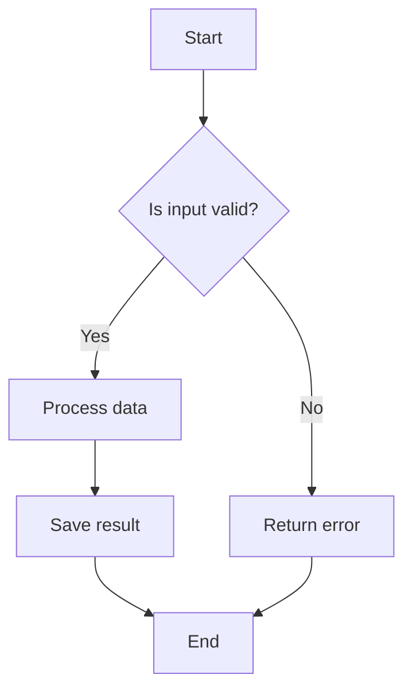
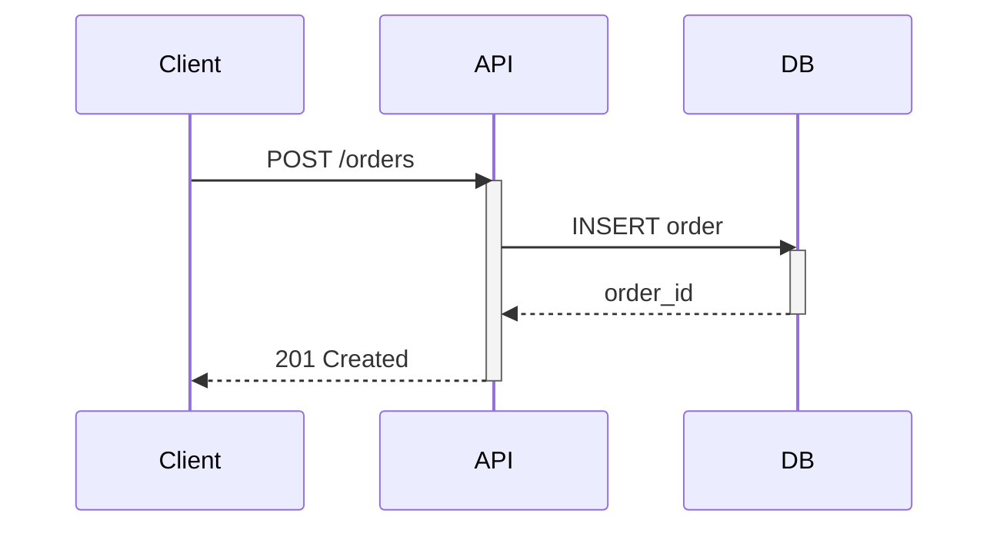
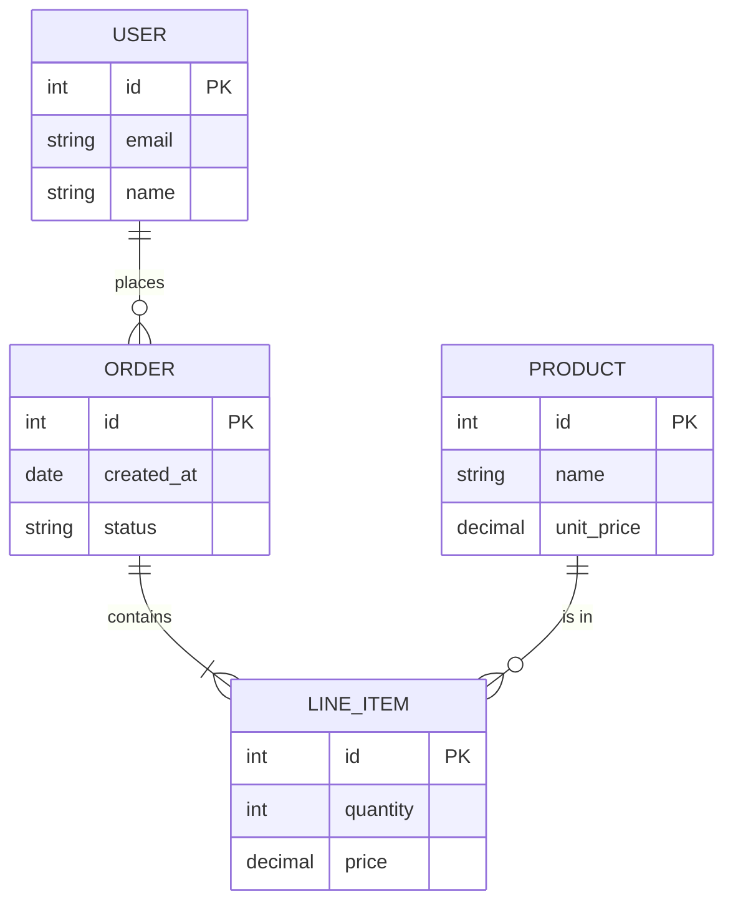
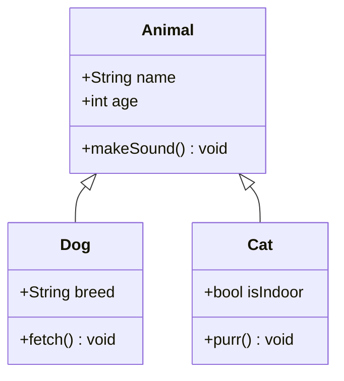
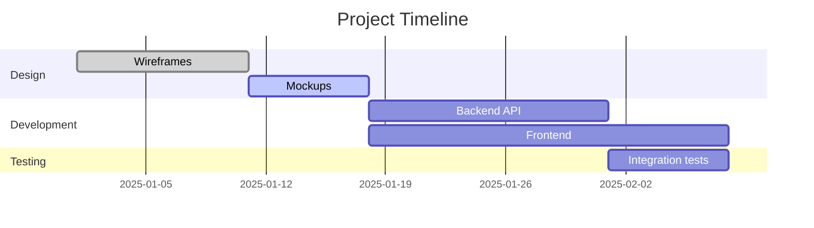
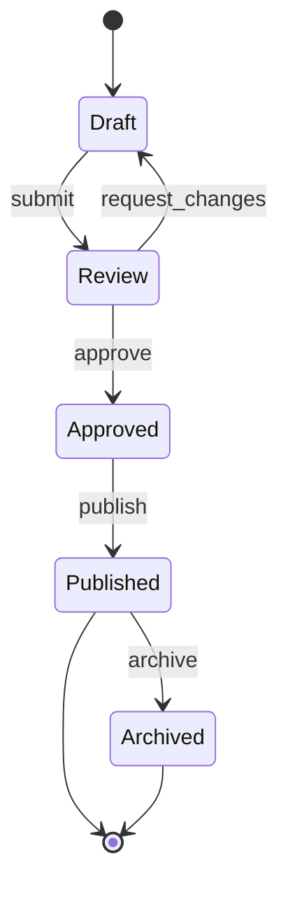
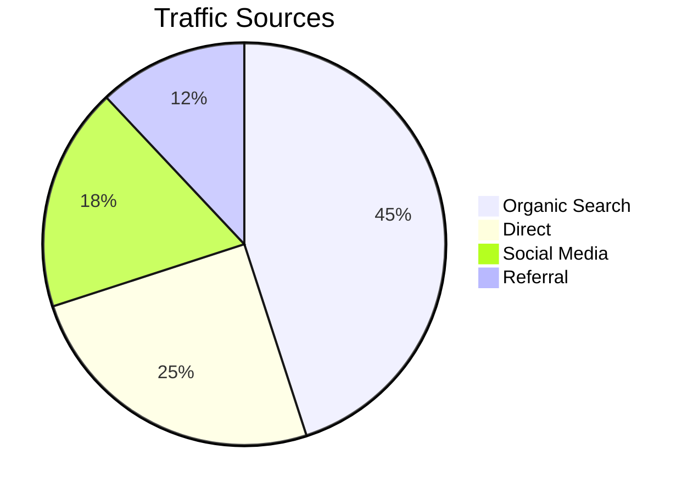
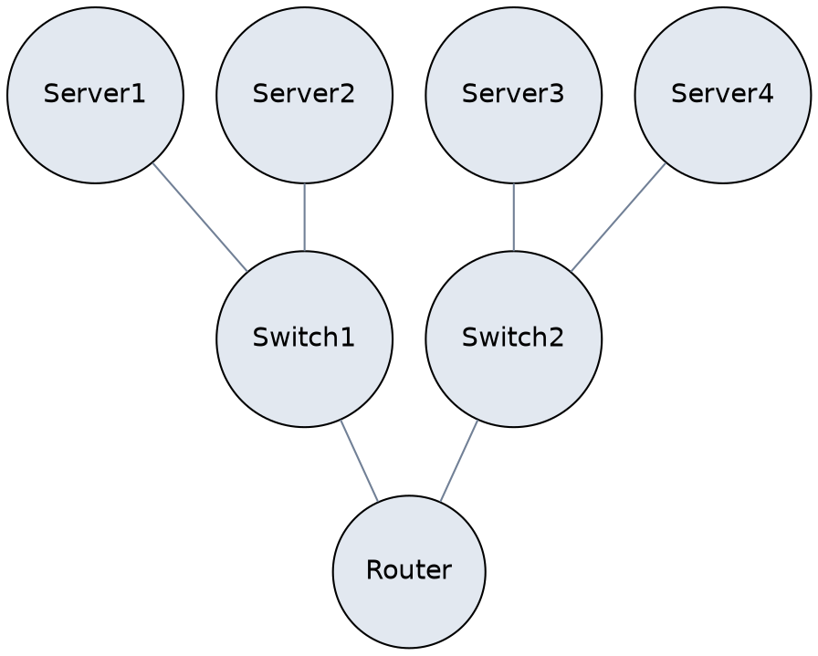
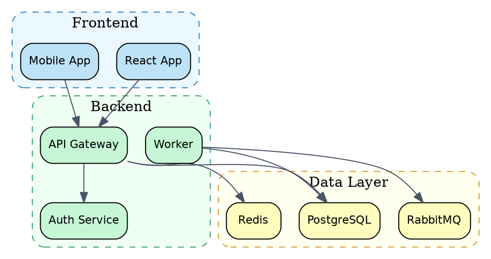

# Diagram Generator

## Requirements

- **System:** `python3`, `graphviz` (provides `dot`/`neato`/etc.), `node` + `@mermaid-js/mermaid-cli` (provides `mmdc`)
- **Python (optional):** `cairosvg` — only for `scripts/render_svg.py` (SVG→PNG conversion). The two main scripts (`generate_graphviz.py`, `generate_mermaid.py`) have no pip dependencies.

Generate professional, publication-quality diagrams using **Mermaid** and **Graphviz (DOT)**. Every diagram should look meticulously crafted — clean lines, balanced composition, intentional use of color, and precise spatial relationships. The goal is not merely correct output but work that demonstrates expert-level visual communication.

## Visual Quality Principles

- **Craftsmanship over decoration**: Every element — node, edge, label, color — must earn its place. Remove anything that does not serve comprehension.
- **Spatial clarity**: Generous spacing between elements. Nothing should overlap or crowd. Whitespace is a structural tool, not leftover canvas.
- **Color with purpose**: Use color to encode meaning (status, category, flow direction), never for ornamentation. Limit palettes to 3-5 intentional colors.
- **Typographic restraint**: Labels are concise. Use consistent font sizing. Hierarchy is communicated through weight and position, not font variety.
- **Visual hierarchy**: The viewer's eye should follow the intended reading order without effort — primary flows are prominent, secondary details recede.
- **Cohesive composition**: The diagram should feel like a single unified artifact, not a collection of parts.

---

## Installation

### Graphviz (for `generate_graphviz.py`)

System package, no pip needed. Footprint: ~10 MB + deps.

```bash
# macOS
brew install graphviz

# Ubuntu / Debian
apt-get install graphviz

# Alpine
apk add graphviz
```

### Mermaid CLI (for `generate_mermaid.py`)

```bash
npm install -g @mermaid-js/mermaid-cli
```

**Honest footprint warning:**
- npm packages: ~330 MB in the global `node_modules`.
- Chromium cache (downloaded by puppeteer on first install): ~470 MB in `~/.cache/puppeteer/`.
- First install takes 1-2 minutes (downloads Chromium from `storage.googleapis.com`).
- If you are behind a corporate proxy and Chromium fails to download, `mmdc` will fail at runtime. Recover with `npx puppeteer browsers install chrome` or check proxy settings. `generate_mermaid.py` detects this failure mode and prints a targeted error message.

**Note on upstream state:** `mermaid-cli` 11.x currently depends on `puppeteer` 23.x, which will become unsupported. An upstream fix is expected in a future `mermaid-cli` release; this skill does not work around it.

### cairosvg (for `render_svg.py` only)

Only install if you plan to use `scripts/render_svg.py` for SVG→PNG conversion:

```bash
pip install cairosvg
```

The core generation scripts (`generate_graphviz.py`, `generate_mermaid.py`) do **not** import `cairosvg` — they produce PNG directly via `dot -Tpng` / `mmdc -o out.png`.

---

## Mermaid Diagrams

Mermaid is ideal for standard, structured diagrams that follow well-known conventions. Use it for flowcharts, sequences, ER diagrams, class diagrams, Gantt charts, state machines, and pie charts.

### Flowchart



Key points:
- Use `TD` (top-down) or `LR` (left-right) depending on the flow's natural reading direction.
- Label edges to clarify decision logic.
- Keep node text short — 2-4 words.

### Sequence Diagram



Key points:
- Use `activate`/`deactivate` to show processing spans.
- Solid arrows (`->>`) for requests, dashed (`-->>`) for responses.
- Keep participant names short and role-based.

### ER Diagram



Key points:
- Define attributes with types and PK/FK markers.
- Cardinality notation: `||--o{` (one-to-many), `||--|{` (one-to-one-or-more), `}o--o{` (many-to-many).

### Class Diagram



Key points:
- Use `+` for public, `-` for private, `#` for protected.
- Arrows: `<|--` inheritance, `*--` composition, `o--` aggregation.

### Gantt Chart



### State Diagram



### Pie Chart



### Rendering Mermaid

Use `scripts/generate_mermaid.py`:

```bash
# From file
python3 scripts/generate_mermaid.py diagram.mmd --output diagram.svg

# From stdin
echo 'flowchart TD; A-->B' | python3 scripts/generate_mermaid.py --output diagram.png

# With options
python3 scripts/generate_mermaid.py diagram.mmd --output diagram.png --width 1200 --theme dark
```

Supported themes: `default`, `dark`, `forest`, `neutral`.

---

## Graphviz / DOT Diagrams

Use Graphviz when you need precise control over layout, complex node arrangements, clusters (subgraphs), custom shapes, or when the graph topology is irregular and Mermaid's auto-layout produces poor results.

### Directed Graph


### Undirected Graph



### Clusters (Subgraphs)



### Styling Guide

| Attribute     | Purpose                          | Example                           |
|---------------|----------------------------------|-----------------------------------|
| `shape`       | Node shape                       | `box`, `circle`, `diamond`, `record` |
| `style`       | Visual style                     | `filled`, `rounded`, `dashed`     |
| `fillcolor`   | Background color                 | `"#f0f4f8"` or named color        |
| `fontname`    | Font face                        | `"Helvetica"`, `"Courier"`       |
| `rankdir`     | Layout direction                 | `TB`, `LR`, `BT`, `RL`           |
| `compound`    | Allow edges between clusters     | `true`                            |

### Rendering Graphviz

Use `scripts/generate_graphviz.py`:

```bash
# From file
python3 scripts/generate_graphviz.py architecture.dot --output architecture.svg

# From stdin
echo 'digraph { A -> B }' | python3 scripts/generate_graphviz.py --output graph.png

# With layout engine
python3 scripts/generate_graphviz.py graph.dot --output graph.svg --layout neato
```

Layout engines:
- `dot` — hierarchical, best for DAGs and trees (default).
- `neato` — spring model, good for undirected graphs.
- `fdp` — force-directed, similar to neato but for larger graphs.
- `circo` — circular layout, ideal for ring/star topologies.

---

## When to Use Mermaid vs Graphviz

| Criterion                  | Mermaid                          | Graphviz                          |
|----------------------------|----------------------------------|-----------------------------------|
| Standard diagram types     | Flowchart, sequence, ER, Gantt   | Any graph topology                |
| Layout control             | Automatic, limited customization | Fine-grained with engines/attrs   |
| Clusters / subgraphs       | Limited                          | Full support                      |
| Styling                    | Theme-based                      | Per-node/edge attributes          |
| Complexity                 | Simple to moderate               | Moderate to high                  |
| Output quality             | Clean and consistent             | Maximum flexibility               |
| Learning curve             | Low                              | Moderate                          |

**Rule of thumb**: Start with Mermaid. Switch to Graphviz when you need custom layouts, complex clustering, or Mermaid's auto-layout produces unsatisfactory results.

---

## SVG to PNG Conversion

Use `scripts/render_svg.py` to convert any SVG to a high-quality PNG:

```bash
python3 scripts/render_svg.py diagram.svg --output diagram.png --width 2400
```

---

## Scripts Reference

| Script                        | Input              | Output          | Tool         |
|-------------------------------|--------------------|-----------------| -------------|
| `scripts/generate_mermaid.py` | `.mmd` or stdin    | SVG, PNG, PDF   | mmdc         |
| `scripts/generate_graphviz.py`| `.dot` or stdin    | SVG, PNG, PDF   | dot/neato/fdp/circo |
| `scripts/render_svg.py`       | `.svg`             | PNG             | cairosvg     |
